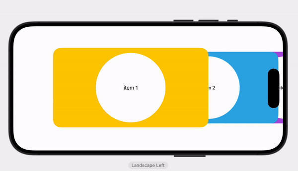

### A Carousel View for SwiftUI


                                
                                
SnapCarouselView can loop through any Identifiable and display it in your custom View.


```swift
    import SwiftUI
    import SnapCarouselView
    
    struct ContentView: View {
        let items : [ItemModel] = []
        @State var index : Int = 0
        var body: some View {
            SnapCarouselView(nextIndex : $index, cards: items) { index, item in
                //index
                ItemView(item)
            }
        }
    }
    //Your data type. It has to conform to identifiable
    struct ItemModel : Identifiable {
        }
        
    //Your View that will display the data from you data type
    struct ItemView : View {
        let item : ItemModel
        
        var body: some View {
            // Your code
        }
    }
```
